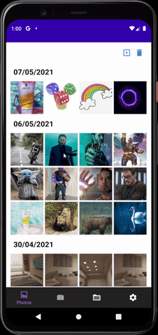
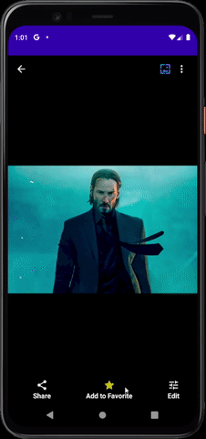
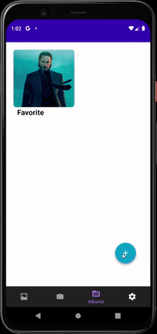

# image Album

An android project of image and video gallery written in Java.

Icons made by <a href="https://www.flaticon.com/authors/vectors-market" title="Vectors Market">Vectors Market</a> from <a href="https://www.flaticon.com/" title="Flaticon">www.flaticon.com</a>

# App functions

- [ ] Show list(s) of images/ videos by multiple layout
- [x] Show list(s) of images/ videos by album
- [x] Show list(s) of images/ videos by date
- [ ] Show list(s) of images that contain people (face detection and grouping)
- [x] Display Image, play video
- [x] Show image/ video detail
- [x] Delete image/ video
- [ ] Copy image/ video
- [x] Create Favorite album and manage its image/ video
- [x] Secure Album (Album has password)
- [x] Location tag of image/ media (show as image/ video detail)
- [x] Perform slide show of image
- [x] Share image/ video to other app
- [x] Set phone wallpaper (Home wallpaper)
- [x] Take a picture
- [x] Record a video
- [x] Edit image (Add icon, draw, filter, crop, rotation)
- [x] Multiple language (Vietnamese, English)
- [x] Multiple theme (Dark, Light theme)
- [ ] Choose app as a default app for viewing image

# Review

<h6> Slide show </h6>

<h6> Add image to favorite album </h6>

<h6> Edit image </h6>

<h6> Change app theme </h6>

# Contributors

- Ho Nguyen Huy Hoang (Student's ID: 18127006)
- Pham Vu Duy (Student's ID: 18127092)

VNU University of Science - CSC13009 - Developing android app course

# Libraries used

- [google/gson: A Java serialization/deserialization library to convert Java Objects into JSON and back (github.com)](https://github.com/google/gson)
- (Slide show function) [smarteist/Android-Image-Slider: Android Auto Image Slider (github.com)](https://github.com/smarteist/Android-Image-Slider)
- (Show image) [bumptech/glide: An image loading and caching library for Android focused on smooth scrolling (github.com)](https://github.com/bumptech/glide)
- (show image) [Piasy/BigImageViewer: Big image viewer supporting pan and zoom, with very little memory usage and full featured image loading choices. Powered by Subsampling Scale Image View, Fresco, Glide, and Picasso. Even with gif and webp support! 🍻 (github.com)](https://github.com/Piasy/BigImageViewer)
- [zendesk/android-floating-action-button: Floating Action Button for Android based on Material Design specification (github.com)](https://github.com/zendesk/android-floating-action-button)
- (Image edit) [siwangqishiq/ImageEditor-Android: AndroidImageEdit 安卓设备上图形编辑开源控件，支持磨皮美白 自定义贴图 图片滤镜 图片旋转 图片剪裁 文字贴图 撤销 回退 等操作 (github.com)](https://github.com/siwangqishiq/ImageEditor-Android)

